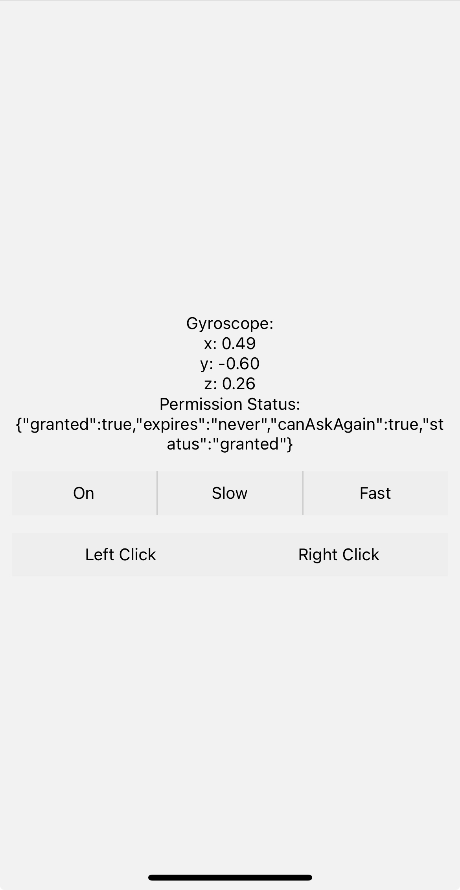
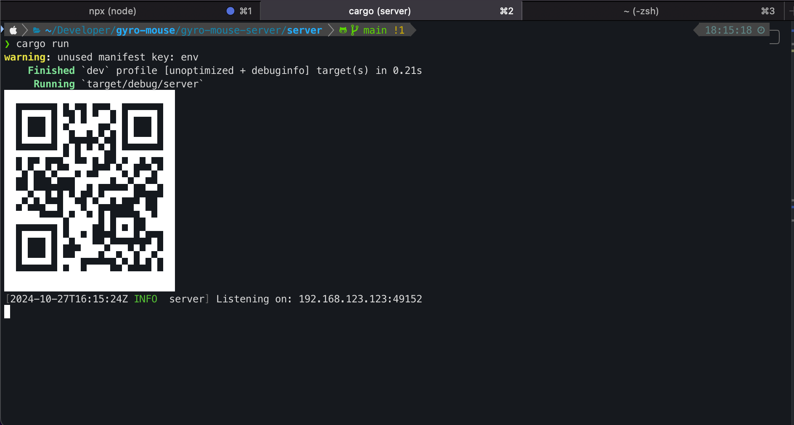

# Remote Mouse Control

This project enables remote mouse control using a mobile device. It consists of a **server written in Rust** and a client application built with **Expo, a React Native framework**. The mobile app captures gyroscope data and click events, which are then transmitted to the server via UDP. The server processes these events to control the mouse cursor on the computer.

# Features

- **Gyroscope-Based Mouse Movement**: Control the mouse cursor by tilting and moving your mobile device.
- **Left and Right Click Support**: Use on-screen buttons in the mobile app to perform left and right clicks seamlessly.
- **UDP Communication**: Real-time data transfer between the mobile app and the Rust server over UDP.
- **QR Code Connection Setup**: Quickly connect the mobile app to the server by scanning a QR code, which displays the server's URL for easy configuration.

## Screenshots

